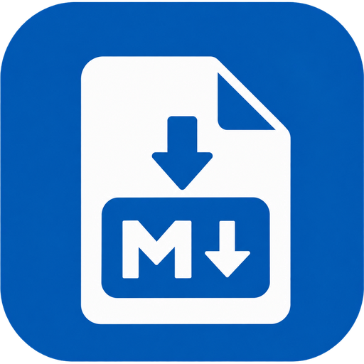

# Markwright

---

A local, privacy-first PDF to Markdown converter that preserves tables, headings and images. Built with a beginner-friendly GUI and a scriptable CLI, so both non-technical users and developers can use it — no internet connection required after setup, available in English and Spanish.

<!-- Tech Stack Badges -->

---

**Status:** In development. Full documentation, features and usage instructions will land as the project progresses.
