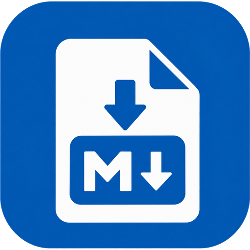

<div align="center">

[](README.md)
[](README_es.md)



# Markwright

---

A local, privacy-first PDF to Markdown converter that preserves tables, headings and images. Built with a beginner-friendly GUI and a scriptable CLI, so both non-technical users and developers can use it — no internet connection required after the first-time model download, available in English and Spanish.

<!-- Tech Stack Badges -->


[](CHANGELOG.md)
[](LICENSE)

</div>

---

## What it does

Markwright converts a PDF file into a Markdown file, keeping the structure that
usually gets lost in a naive conversion: tables, lists, heading hierarchy, and
the images embedded in the document. It reads scanned/image-only pages with OCR
(EasyOCR) as well as PDFs with a real text layer, and can decrypt
password-protected PDFs in memory. Everything runs on your own machine — see
[Privacy](#privacy) below.

You can use it three ways:

- **A graphical interface** — double-click to open, choose a PDF, click convert.
  No command line needed.
- **A command-line tool**, for scripting: `markwright report.pdf`.
- **An interactive terminal menu**, for picking a file without typing its full
  path: `markwright menu`.

The interface (GUI and CLI) is available in English and Spanish; you can change
it, along with light/dark theme and font size, from the gear icon in the GUI.

## Try it now (from source)

Markwright doesn't have a packaged, downloadable executable yet (that's planned
for the `v1.0.0` release — see [CHANGELOG.md](CHANGELOG.md)). Until then, running
it from source is straightforward:

**Requirements:** Python 3.12+ and [uv](https://docs.astral.sh/uv/).

```bash
git clone https://github.com/isa-bos-dev/markwright.git
cd markwright
uv sync
```

Then, any of:

```bash
uv run markwright                  # opens the graphical interface
uv run markwright report.pdf       # converts one file from the command line
uv run markwright menu             # interactive menu: pick a PDF from a list
uv run markwright --help           # every CLI option (language, output path, ...)
```

The first conversion downloads the OCR/layout models it needs (a few hundred MB)
from their official sources. After that, every conversion runs fully offline.

Developed and tested primarily on Windows; the GUI's visual theme specifically
targets Windows 11. The underlying code has fallbacks for opening the output
folder on macOS/Linux, but those platforms haven't been verified yet.

## Privacy

The content of your PDFs never leaves your machine. The only network request
Markwright ever makes is the one-time download of its own ML models, from their
official sources (Hugging Face, EasyOCR) — never your documents. See
[SECURITY.md](SECURITY.md) for the full picture, including the risks that are
known and explicitly accepted rather than overlooked.

## Project status

Pre-1.0, in active development. See [CHANGELOG.md](CHANGELOG.md) for what's
already there and [SECURITY.md](SECURITY.md) for the security policy and how to
report a vulnerability.

## Contributing

See [CONTRIBUTING.md](CONTRIBUTING.md) for how to set up the development
environment and what's expected in a pull request.

## License

[Apache-2.0](LICENSE). See [NOTICE](NOTICE) for attribution requirements.
